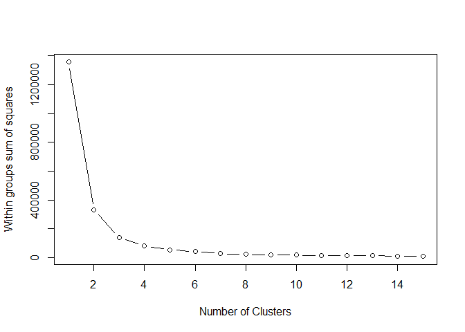
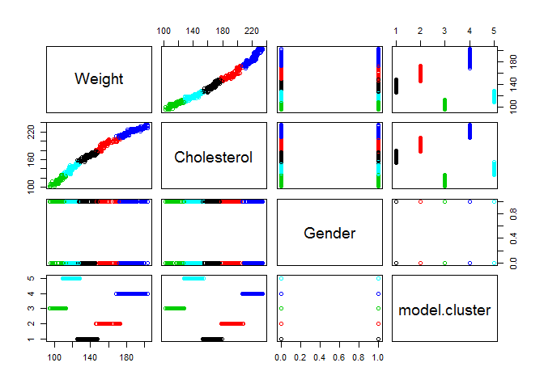

Simple K-Means Clustering
================
Joshua T Pierce
June 5, 2017

Clustering Heart Attack Risk Based on 3 Predictors

First, read in and examine the data:

``` r
data <- read.csv("C:/Users/piercj01/Desktop/K-Means/clusteringdata.csv", header=TRUE , sep=",")

str(data)
```

    ## 'data.frame':    547 obs. of  3 variables:
    ##  $ Weight     : int  102 115 115 140 130 198 114 145 191 186 ...
    ##  $ Cholesterol: int  111 135 136 167 158 227 131 176 223 221 ...
    ##  $ Gender     : int  1 1 1 0 1 1 1 0 0 1 ...

Each observation is an insurance polichyholder, and we want to classify their heart attack risk based on the three variables: weight, cholesterol, and gender.

For K-means clustering, we need to specify the number (k) of clusters we wish to extract. Accordingly, the observations will be classified via similarities in the mean value of the variables, hence “k-means”

The plot below shows the sum of squared error per number of clusters, so we need to choose a cluster number that minimizes error while still being few enough that the differences in the centroids are actually meaningful:

``` r
wss <- (nrow(data)-1)*sum(apply(data,2,var))
for (i in 2:15) wss[i] <- sum(kmeans(data, 
    centers=i)$withinss)

plot(1:15, wss, type="b", xlab="Number of Clusters",
  ylab="Within groups sum of squares")
```



In this case, we will choose 5 clusters, as it will minimize error but still have significance between clusters/centroids.

Next, call the kmeans() function on the dataset, specifying the number of clusters. This will create the clusters themselves by scanning the dataset and calculating the means (centroids).

Then, use the aggregate() function to cluster the observations around these means.

Lastly, re-assign this output as a dataframe (this will help visualize the results)

``` r
model <- kmeans(data , 5)

aggregate(data,by=list(model$cluster),FUN=mean)
```

    ##   Group.1   Weight Cholesterol    Gender
    ## 1       1 136.3738    165.5234 0.3925234
    ## 2       2 157.6238    193.0594 0.5247525
    ## 3       3 103.7216    114.1856 0.6185567
    ## 4       4 185.9783    220.5580 0.5579710
    ## 5       5 118.2308    139.4615 0.4711538

``` r
data <- data.frame(data, model$cluster)

data
```

    ##     Weight Cholesterol Gender model.cluster
    ## 1      102         111      1             3
    ## 2      115         135      1             5
    ## 3      115         136      1             5
    ## 4      140         167      0             1
    ## 5      130         158      1             1
    ## 6      198         227      1             4
    ## 7      114         131      1             5
    ## 8      145         176      0             1
    ## 9      191         223      0             4
    ## 10     186         221      1             4
    ## 11     104         116      0             3
    ## 12     188         222      1             4
    ## 13      96         102      0             3
    ## 14     156         192      0             2
    ## 15     125         152      0             5
    ## 16     178         213      0             4
    ## 17     109         125      0             3
    ## 18     168         204      1             2
    ## 19     152         189      0             2
    ## 20     133         163      0             1
    ## 21     153         189      0             2
    ## 22     107         122      0             3
    ## 23     199         228      1             4
    ## 24     140         168      0             1
    ## 25      95         102      1             3
    ## 26     183         218      0             4
    ## 27     108         123      0             3
    ## 28     190         222      0             4
    ## 29     174         208      1             4
    ## 30     149         183      1             2
    ## 31     169         204      1             2
    ## 32     138         167      1             1
    ## 33     151         188      1             2
    ## 34     109         126      1             3
    ## 35     178         213      0             4
    ## 36     106         122      1             3
    ## 37     195         225      1             4
    ## 38      96         105      1             3
    ## 39     129         155      0             1
    ## 40     166         203      1             2
    ## 41     197         225      1             4
    ## 42     148         177      1             1
    ## 43     117         139      1             5
    ## 44     193         224      0             4
    ## 45     170         207      1             2
    ## 46     130         158      0             1
    ## 47     183         218      1             4
    ## 48     134         164      0             1
    ## 49     128         154      0             1
    ## 50     105         118      0             3
    ## 51     115         138      0             5
    ## 52     166         199      1             2
    ## 53     183         219      1             4
    ## 54     149         183      1             2
    ## 55     110         128      0             5
    ## 56     164         197      0             2
    ## 57     157         196      0             2
    ## 58     170         208      0             2
    ## 59     124         152      1             5
    ## 60     145         175      1             1
    ## 61     113         129      0             5
    ## 62     150         185      0             2
    ## 63     100         107      1             3
    ## 64     178         211      1             4
    ## 65     139         167      0             1
    ## 66     150         185      1             2
    ## 67     101         110      1             3
    ## 68     157         194      1             2
    ## 69     187         221      0             4
    ## 70     137         166      0             1
    ## 71     121         143      1             5
    ## 72     132         163      0             1
    ## 73     130         158      1             1
    ## 74     156         191      0             2
    ## 75     180         216      0             4
    ## 76     100         106      1             3
    ## 77     122         146      0             5
    ## 78     185         220      0             4
    ## 79     113         131      0             5
    ## 80     123         147      0             5
    ## 81     119         141      0             5
    ## 82     113         130      1             5
    ## 83     168         204      1             2
    ## 84     126         152      1             5
    ## 85     102         111      1             3
    ## 86     116         139      1             5
    ## 87     144         172      1             1
    ## 88     140         168      0             1
    ## 89     124         148      0             5
    ## 90     108         123      0             3
    ## 91     154         189      0             2
    ## 92     185         220      0             4
    ## 93     106         120      1             3
    ## 94      97         106      1             3
    ## 95      96         105      0             3
    ## 96     129         157      1             1
    ## 97     124         149      1             5
    ## 98     149         185      0             2
    ## 99      97         106      0             3
    ## 100    102         115      1             3
    ## 101    146         177      1             1
    ## 102    199         230      0             4
    ## 103    100         108      0             3
    ## 104    118         140      0             5
    ## 105    179         214      1             4
    ## 106    179         216      1             4
    ## 107    113         130      0             5
    ## 108    142         169      0             1
    ## 109    101         110      1             3
    ## 110    174         209      1             4
    ## 111    131         162      1             1
    ## 112    179         214      1             4
    ## 113    122         145      1             5
    ## 114    105         116      1             3
    ## 115    176         209      0             4
    ## 116    103         116      1             3
    ## 117    120         139      1             5
    ## 118    118         143      1             5
    ## 119    143         168      0             1
    ## 120    134         158      1             1
    ## 121    203         232      1             4
    ## 122    116         136      1             5
    ## 123    150         180      0             2
    ## 124    192         228      0             4
    ## 125    187         222      1             4
    ## 126    107         117      0             3
    ## 127    192         224      1             4
    ## 128     97         104      0             3
    ## 129    157         195      0             2
    ## 130    128         156      0             1
    ## 131    183         213      0             4
    ## 132    112         133      0             5
    ## 133    173         208      1             4
    ## 134    156         195      0             2
    ## 135    137         163      0             1
    ## 136    156         195      0             2
    ## 137    112         124      0             3
    ## 138    203         231      1             4
    ## 139    141         172      0             1
    ## 140     97         104      1             3
    ## 141    186         221      0             4
    ## 142    113         128      0             5
    ## 143    195         222      0             4
    ## 144    175         214      1             4
    ## 145    154         184      1             2
    ## 146    173         204      1             2
    ## 147    141         171      1             1
    ## 148    152         195      1             2
    ## 149    114         132      1             5
    ## 150    181         214      0             4
    ## 151    111         123      1             3
    ## 152    200         233      1             4
    ## 153    100         107      1             3
    ## 154    134         162      0             1
    ## 155    167         204      1             2
    ## 156    198         227      1             4
    ## 157    151         185      1             2
    ## 158    121         142      1             5
    ## 159    196         225      0             4
    ## 160    171         212      1             4
    ## 161    135         161      0             1
    ## 162    186         220      1             4
    ## 163    138         168      0             1
    ## 164    133         155      0             1
    ## 165    107         125      0             3
    ## 166    120         144      0             5
    ## 167    168         201      1             2
    ## 168    184         222      1             4
    ## 169    154         189      1             2
    ## 170    115         132      0             5
    ## 171    168         204      0             2
    ## 172    161         201      0             2
    ## 173    171         211      0             4
    ## 174    129         156      1             1
    ## 175    150         179      1             2
    ## 176    118         129      0             5
    ## 177    154         185      0             2
    ## 178    103         107      1             3
    ## 179    180         213      1             4
    ## 180    141         172      0             1
    ## 181    152         193      1             2
    ## 182    104         114      1             3
    ## 183    159         202      1             2
    ## 184    191         222      0             4
    ## 185    142         168      0             1
    ## 186    123         146      1             5
    ## 187    135         170      0             1
    ## 188    132         165      1             1
    ## 189    158         196      0             2
    ## 190    181         224      0             4
    ## 191    105         108      1             3
    ## 192    126         149      0             5
    ## 193    186         224      0             4
    ## 194    116         136      0             5
    ## 195    124         152      0             5
    ## 196    122         143      0             5
    ## 197    115         135      1             5
    ## 198    173         211      1             4
    ## 199    128         156      1             1
    ## 200    103         115      1             3
    ## 201    120         143      1             5
    ## 202    146         179      1             1
    ## 203    145         173      0             1
    ## 204    125         148      0             5
    ## 205    109         127      0             3
    ## 206    156         194      0             2
    ## 207    187         225      0             4
    ## 208    110         127      1             3
    ## 209    100         106      1             3
    ## 210     97         112      0             3
    ## 211    133         164      1             1
    ## 212    128         151      1             5
    ## 213    154         191      0             2
    ## 214    100         110      0             3
    ## 215    104         116      1             3
    ## 216    149         180      1             2
    ## 217    203         235      0             4
    ## 218    104         108      0             3
    ## 219    119         141      0             5
    ## 220    181         219      1             4
    ## 221    180         219      1             4
    ## 222    116         138      0             5
    ## 223    144         169      0             1
    ## 224    102         116      1             3
    ## 225    176         212      1             4
    ## 226    135         162      1             1
    ## 227    184         220      1             4
    ## 228    124         151      1             5
    ## 229    110         119      1             3
    ## 230    180         212      0             4
    ## 231    103         111      1             3
    ## 232    117         142      1             5
    ## 233    120         138      1             5
    ## 234    145         172      0             1
    ## 235    133         158      1             1
    ## 236    201         228      1             4
    ## 237    117         134      1             5
    ## 238    146         181      0             2
    ## 239    195         231      0             4
    ## 240    188         223      1             4
    ## 241    108         121      0             3
    ## 242    191         222      1             4
    ## 243    100         102      0             3
    ## 244    158         195      0             2
    ## 245    127         156      0             1
    ## 246    181         214      0             4
    ## 247    113         132      0             5
    ## 248    171         204      1             2
    ## 249    153         190      0             2
    ## 250    137         167      0             1
    ## 251    154         195      0             2
    ## 252    112         127      0             5
    ## 253    201         235      1             4
    ## 254    141         171      0             1
    ## 255    100         110      1             3
    ## 256    185         221      0             4
    ## 257    111         128      0             5
    ## 258    191         226      0             4
    ## 259    176         208      1             4
    ## 260    150         191      1             2
    ## 261    171         205      1             2
    ## 262    140         173      1             1
    ## 263    153         191      1             2
    ## 264    111         128      1             5
    ## 265    180         220      0             4
    ## 266    107         126      1             3
    ## 267    197         232      1             4
    ## 268    101         108      1             3
    ## 269    132         159      0             1
    ## 270    168         211      1             4
    ## 271    200         232      1             4
    ## 272    150         182      1             2
    ## 273    119         145      1             5
    ## 274    197         224      0             4
    ## 275    172         209      1             4
    ## 276    134         160      0             1
    ## 277    185         219      1             4
    ## 278    135         170      0             1
    ## 279    132         161      0             1
    ## 280    109         122      0             3
    ## 281    116         141      0             5
    ## 282    170         204      1             2
    ## 283    187         226      1             4
    ## 284    154         187      1             2
    ## 285    111         129      0             5
    ## 286    169         199      0             2
    ## 287    161         199      0             2
    ## 288    174         214      0             4
    ## 289    125         159      1             1
    ## 290    148         176      1             1
    ## 291    117         129      0             5
    ## 292    154         187      0             2
    ## 293    104         109      1             3
    ## 294    183         212      1             4
    ## 295    142         170      0             1
    ## 296    155         191      1             2
    ## 297    105         116      1             3
    ## 298    160         202      1             2
    ## 299    191         226      0             4
    ## 300    140         166      0             1
    ## 301    123         151      1             5
    ## 302    136         170      0             1
    ## 303    132         166      1             1
    ## 304    158         193      0             2
    ## 305    182         218      0             4
    ## 306    104         109      1             3
    ## 307    126         152      0             5
    ## 308    188         220      0             4
    ## 309    118         133      0             5
    ## 310    127         152      0             5
    ## 311    123         142      0             5
    ## 312    118         131      1             5
    ## 313    169         204      1             2
    ## 314    128         153      1             1
    ## 315    106         114      1             3
    ## 316    119         144      1             5
    ## 317    147         172      1             1
    ## 318    141         176      0             1
    ## 319    125         150      0             5
    ## 320    109         129      0             5
    ## 321    158         190      0             2
    ## 322    190         226      0             4
    ## 323    110         128      1             5
    ## 324     99         106      1             3
    ## 325     98         107      0             3
    ## 326    134         159      1             1
    ## 327    129         157      1             1
    ## 328    154         192      0             2
    ## 329    100         110      0             3
    ## 330    107         115      1             3
    ## 331    149         183      1             2
    ## 332    203         233      0             4
    ## 333    101         112      0             3
    ## 334    119         146      0             5
    ## 335    182         222      1             4
    ## 336    181         216      1             4
    ## 337    115         134      0             5
    ## 338    145         174      0             1
    ## 339    102         114      1             3
    ## 340    176         211      1             4
    ## 341    134         167      1             1
    ## 342    183         214      1             4
    ## 343    123         145      1             5
    ## 344    108         120      1             3
    ## 345    177         217      0             4
    ## 346    104         113      1             3
    ## 347    117         141      1             5
    ## 348    117         140      1             5
    ## 349    145         171      0             1
    ## 350    134         163      1             1
    ## 351    199         232      1             4
    ## 352    115         131      1             5
    ## 353    149         184      0             2
    ## 354    192         225      0             4
    ## 355    188         223      1             4
    ## 356    107         121      0             3
    ## 357    190         223      1             4
    ## 358     98         105      0             3
    ## 359    158         197      0             2
    ## 360    128         160      0             1
    ## 361    180         218      0             4
    ## 362    110         131      0             5
    ## 363    172         211      1             4
    ## 364    157         194      0             2
    ## 365    137         169      0             1
    ## 366    158         189      0             2
    ## 367    110         128      0             5
    ## 368    203         228      1             4
    ## 369    145         169      0             1
    ## 370     96         108      1             3
    ## 371    186         219      0             4
    ## 372    110         124      0             3
    ## 373    194         224      0             4
    ## 374    177         214      1             4
    ## 375    152         190      1             2
    ## 376    172         205      1             2
    ## 377    140         167      1             1
    ## 378    154         190      1             2
    ## 379    113         128      1             5
    ## 380    179         217      0             4
    ## 381    111         126      1             3
    ## 382    196         228      1             4
    ## 383    101         105      1             3
    ## 384    131         162      0             1
    ## 385    171         211      1             4
    ## 386    199         227      1             4
    ## 387    151         178      1             2
    ## 388    121         146      1             5
    ## 389    196         227      0             4
    ## 390    174         208      1             4
    ## 391    135         163      0             1
    ## 392    184         225      1             4
    ## 393    137         167      0             1
    ## 394    129         162      0             1
    ## 395    108         125      0             3
    ## 396    116         144      0             5
    ## 397    168         199      1             2
    ## 398    184         226      1             4
    ## 399    151         183      1             2
    ## 400    114         136      0             5
    ## 401    167         199      0             2
    ## 402    160         204      0             2
    ## 403    175         215      0             4
    ## 404    127         155      1             1
    ## 405    146         179      1             1
    ## 406    118         133      0             5
    ## 407    151         186      0             2
    ## 408    105         111      1             3
    ## 409    180         219      1             4
    ## 410    140         173      0             1
    ## 411    155         185      1             2
    ## 412    106         118      1             3
    ## 413    160         199      1             2
    ## 414    192         226      0             4
    ## 415    138         169      0             1
    ## 416    122         144      1             5
    ## 417    135         166      0             1
    ## 418    132         166      1             1
    ## 419    158         198      0             2
    ## 420    184         222      0             4
    ## 421    101         110      1             3
    ## 422    126         154      0             1
    ## 423    188         226      0             4
    ## 424    118         135      0             5
    ## 425    127         151      0             5
    ## 426    123         146      0             5
    ## 427    117         133      1             5
    ## 428    172         205      1             2
    ## 429    127         154      1             1
    ## 430    104         116      1             3
    ## 431    121         145      1             5
    ## 432    148         174      1             1
    ## 433    141         168      0             1
    ## 434    128         156      0             1
    ## 435    113         124      0             3
    ## 436    155         196      0             2
    ## 437    189         227      0             4
    ## 438    108         122      1             3
    ## 439     98         106      1             3
    ## 440    100         110      0             3
    ## 441    134         158      1             1
    ## 442    125         154      1             5
    ## 443    151         190      0             2
    ## 444    100         110      0             3
    ## 445    107         120      1             3
    ## 446    147         180      1             2
    ## 447    200         232      0             4
    ## 448    101         110      0             3
    ## 449    120         142      0             5
    ## 450    181         222      1             4
    ## 451    182         218      1             4
    ## 452    117         138      0             5
    ## 453    145         176      0             1
    ## 454    106         115      1             3
    ## 455    179         211      1             4
    ## 456    134         168      1             1
    ## 457    180         216      1             4
    ## 458    126         147      1             5
    ## 459    110         124      1             3
    ## 460    180         215      0             4
    ## 461    103         117      1             3
    ## 462    116         139      1             5
    ## 463    119         138      1             5
    ## 464    144         171      0             1
    ## 465    133         158      1             1
    ## 466    199         232      1             4
    ## 467    115         139      1             5
    ## 468    150         178      0             2
    ## 469    192         224      0             4
    ## 470    188         224      1             4
    ## 471    109         116      0             3
    ## 472    189         223      1             4
    ## 473    101         109      0             3
    ## 474    159         193      0             2
    ## 475    128         155      0             1
    ## 476    182         221      0             4
    ## 477    111         130      0             5
    ## 478    171         212      1             4
    ## 479    154         190      0             2
    ## 480    134         169      0             1
    ## 481    157         191      0             2
    ## 482    112         122      0             3
    ## 483    203         234      1             4
    ## 484    142         175      0             1
    ## 485     97         108      1             3
    ## 486    187         220      0             4
    ## 487    111         126      0             3
    ## 488    194         227      0             4
    ## 489    176         216      1             4
    ## 490    153         188      1             2
    ## 491    171         205      1             2
    ## 492    142         172      1             1
    ## 493    153         192      1             2
    ## 494    113         129      1             5
    ## 495    183         219      0             4
    ## 496    108         127      1             3
    ## 497    200         228      1             4
    ## 498     99         105      1             3
    ## 499    131         159      0             1
    ## 500    171         205      1             2
    ## 501    200         228      1             4
    ## 502    152         178      1             2
    ## 503    119         139      1             5
    ## 504    196         232      0             4
    ## 505    173         212      1             4
    ## 506    132         162      0             1
    ## 507    185         226      1             4
    ## 508    138         171      0             1
    ## 509    132         159      0             1
    ## 510    110         120      0             3
    ## 511    119         143      0             5
    ## 512    167         200      1             2
    ## 513    188         221      1             4
    ## 514    151         184      1             2
    ## 515    112         134      0             5
    ## 516    166         200      0             2
    ## 517    158         201      0             2
    ## 518    172         210      0             4
    ## 519    127         159      1             1
    ## 520    150         178      1             2
    ## 521    115         137      0             5
    ## 522    151         190      0             2
    ## 523    103         110      1             3
    ## 524    181         213      1             4
    ## 525    141         170      0             1
    ## 526    152         193      1             2
    ## 527    105         113      1             3
    ## 528    162         196      1             2
    ## 529    190         222      0             4
    ## 530    141         174      0             1
    ## 531    122         143      1             5
    ## 532    136         169      0             1
    ## 533    131         165      1             1
    ## 534    157         194      0             2
    ## 535    181         217      0             4
    ## 536    103         113      1             3
    ## 537    127         150      0             5
    ## 538    189         223      0             4
    ## 539    114         133      0             5
    ## 540    125         149      0             5
    ## 541    123         149      0             5
    ## 542    116         130      1             5
    ## 543    172         207      1             4
    ## 544    129         157      1             1
    ## 545    107         115      1             3
    ## 546    117         147      1             5
    ## 547    148         176      1             1

Here we see the summary values for each five clusters.

Lastly, plot the clusters:

``` r
plot(data , col=model$cluster)
```



This plot matrix shows the clusters according to color and each explanatory variable.
